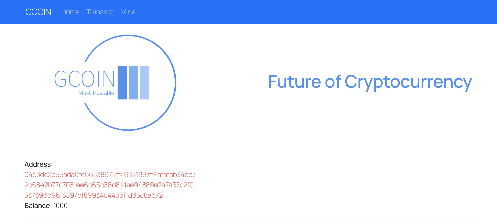
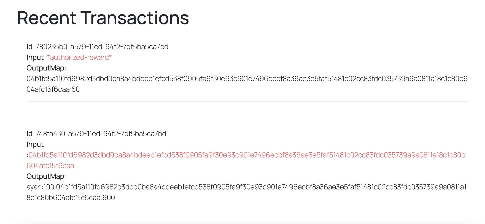

# Blockchain from Scratch

Made an entire blockchain from scratch using Javascript, it has the following elements,

1. Block
2. Chain of Blocks
3. Wallet
4. Transaction Pool
5. Transactions(UTXO)
\
We have used **Redis** for the communication between blocks using the Publisher and Subscriber  or PubSub concept.
\
We have also used **Node** with __express__ framework for the backend and used __ReactJs__ in the frontend.

## Features

- Users can view recent transactions
- Users can conduct transactions
- Users can mine the transactions in their transaction pool
- Cross platform(Responsive Design)


## Run Locally

Clone the project

```bash
  git clone https://link-to-project
```

Go to the project directory

```bash
  cd my-project
```

Install dependencies

```bash
  npm install
```

Start the server

```bash
  npm run start
```
Visit http://localhost:3000, 

To run in developement mode use the scripts
```bash
  npm run dev
```
and to run simple peers for testing purposes
```bash
  npm run dev-peer
```

## Screenshots


